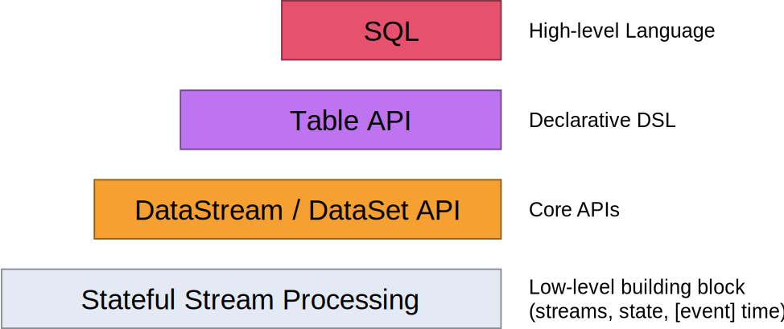

# 数据流编程模型

> 译者：[flink.sojb.cn](https://flink.sojb.cn/)

## 抽象层次

Flink提供不同级别的抽象来开发流/批处理应用程序。

*   最低级抽象只提供**有状态流**。它 通过[Process Function](https://flink.sojb.cn/dev/stream/operators/process_function.html)嵌入到[DataStream API中](https://flink.sojb.cn/dev/datastream_api.html)。它允许用户自由处理来自一个或多个流的事件，并使用一致的容错_状态_。此外，用户可以注册事件时间和处理时间回调，允许程序实现复杂的计算。

*   实际上，大多数应用程序不需要上述低级抽象，而是针对**Core API**编程， 如[DataStream API](https://flink.sojb.cn/dev/datastream_api.html)（有界/无界流）和[DataSet API](https://flink.sojb.cn/dev/batch/index.html) （有界数据集）。这些流畅的API提供了用于数据处理的通用构建块，例如各种形式的用户指定的转换，连接，聚合，窗口，状态等。在这些API中处理的数据类型在相应的编程语言中表示为类。

    低级_Process Function_与_DataStream API_集成，因此只能对某些 算子操作进行低级抽象。该_数据集API_提供的有限数据集的其他原语，如循环/迭代。

*   该 **Table API**是为中心的声明性DSL _表_，其可被动态地改变的表（表示流时）。该 [Table API](https://flink.sojb.cn/dev/table_api.html)遵循（扩展）关系模型：表有一个模式连接（类似于在关系数据库中的表）和API提供可比的 算子操作，如选择，项目，连接，分组依据，聚合等 Table API程序以声明方式定义_应该执行的逻辑 算子操作，_而不是准确指定 _算子操作代码的外观_。虽然 Table API可以通过各种类型的用户定义函数进行扩展，但它的表现力不如_Core API_，但使用更简洁（编写的代码更少）。此外， Table API程序还会通过优化程序，在执行之前应用优化规则。

    可以在表和_DataStream_ / _DataSet_之间无缝转换，允许程序混合 _Table API_以及_DataStream_ 和_DataSet_ API。

*   Flink提供的最高级抽象是**SQL**。这种抽象在语义和表达方面类似于 _Table API_，但是将程序表示为SQL查询表达式。在[SQL](https://flink.sojb.cn/dev/table_api.html#sql)抽象与 Table API紧密地相互作用，和SQL查询可以通过定义表来执行 _Table API_。

## 程序和数据流

Flink程序的基本构建块是**流**和**转换**。（请注意，Flink的DataSet API中使用的DataSet也是内部流 - 稍后会详细介绍。）从概念上讲，_流_是（可能永无止境的）数据记录流，而_转换_是将一个或多个流作为一个或多个流的 算子操作。输入，并产生一个或多个输出流。

执行时，Flink程序映射到**流数据流**，由**流**和转换 **算子组成**。每个数据流都以一个或多个**源**开头，并以一个或多个**接收器**结束。数据流类似于任意有**向无环图** _（DAG）_。尽管通过_迭代_结构允许特殊形式的循环 ，但为了简单起见，我们将在大多数情况下对此进行掩饰。

通常，程序中的转换与数据流中的 算子之间存在一对一的对应关系。但是，有时一个转换可能包含多个转换 算子。

源流和接收器记录在[流连接器](https://flink.sojb.cn/dev/connectors/index.html)和[批处理连接器](https://flink.sojb.cn/dev/batch/connectors.html)文档中。[DataStream 算子](https://flink.sojb.cn/dev/stream/operators/index.html)和[DataSet转换](https://flink.sojb.cn/dev/batch/dataset_transformations.html)中记录了[转换](https://flink.sojb.cn/dev/batch/dataset_transformations.html)。

## 并行数据流

Flink中的程序本质上是并行和分布式的。在执行期间，_流_具有一个或多个**流分区**，并且每个 _算子_具有一个或多个 **算子子任务**。 算子子任务彼此独立，并且可以在不同的线程中执行，并且可能在不同的机器或容器上执行。

算子子任务的数量是该特定 算子的**并行**度。流的并行性始终是其生成 算子的并行性。同一程序的不同 算子可能具有不同的并行级别。

流可以_以一对一_（或_转发_）模式或以_重新分发_模式在两个算子之间传输数据：

*   **一对一**流（例如，在上图中的_Source_和_map（）_ 算子之间）保存数据元的分区和排序。这意味着_map（）_ 算子的subtask [1] 将以与_Source_ 算子的subtask [1]生成的顺序相同的顺序看到相同的数据元。

*   **重新分配**流（在上面的_map（）_和_keyBy / window_之间，以及 _keyBy / window_和_Sink之间_）重新分配流。每个 _算子子任务_将数据发送到不同的目标子任务，具体取决于所选的转换。实例是 _keyBy（）_ （其通过散列Keys重新分区），_广播（）_ ，或_Rebalance （）_ （其重新分区随机地）。在_重新分配_交换中，数据元之间的排序仅保存在每对发送和接收子任务中（例如，_map（）的_子任务[1] 和子任务[2]_keyBy / window_）。因此，在此示例中，保存了每个Keys内的排序，但并行性确实引入了关于不同Keys的聚合结果到达接收器的顺序的非确定性。

有关配置和控制并行性的详细信息，请参阅[并行执行](https://flink.sojb.cn/dev/parallel.html)的文档。

## 窗口

聚合事件（例如，计数，总和）在流上的工作方式与批处理方式不同。例如，不可能计算流中的所有数据元，因为流通常是无限的（无界）。相反，流上的聚合（计数，总和等）由**窗口**限定，例如_“在最后5分钟内计数”_或_“最后100个数据元的总和”_。

Windows可以是_时间驱动的_（例如：每30秒）或_数据驱动_（例如：每100个数据元）。一个典型地区分不同类型的窗口，例如_翻滚窗口_（没有重叠）， _滑动窗口_（具有重叠）和_会话窗口_（由不活动的间隙打断）。

更多窗口示例可以在此[博客文章中](https://flink.apache.org/news/2015/12/04/Introducing-windows.html)找到。更多详细信息在[窗口文档中](https://flink.sojb.cn/dev/stream/operators/windows.html)。

## 时间

当在流程序中引用时间（例如定义窗口）时，可以参考不同的时间概念：

*   **事件时间**是创建**事件的时间**。它通常由事件中的时间戳描述，例如由生产传感器或生产服务附加。Flink通过[时间戳分配器](https://flink.sojb.cn/dev/event_timestamps_watermarks.html)访问事件时间戳。

*   **摄取时间**是事件在源算子处输入Flink数据流的时间。

*   **处理时间**是执行基于时间的 算子操作的每个算子的本地时间。

有关如何处理时间的更多详细信息，请参阅[事件时间文档](https://flink.sojb.cn/dev/event_time.html)。

## 有状态的 算子操作

虽然数据流中的许多 算子操作只是一次查看一个单独的_事件_（例如事件解析器），但某些 算子操作会记住多个事件（例如窗口算子）的信息。这些 算子操作称为**有状态**。

状态 算子操作的状态保持在可以被认为是嵌入式键/值存储的状态中。状态被分区并严格地与有状态算子读取的流一起分发。因此，只有在_keyBy（）_函数之后才能在_被Key化的数据流_上访问键/值状态，并且限制为与当前事件的键相关联的值。对齐流和状态的Keys可确保所有状态更新都是本地 算子操作，从而保证一致性而无需事务开销。此对齐还允许Flink重新分配状态并透明地调整流分区。

有关更多信息，请参阅有关[状态](https://flink.sojb.cn/dev/stream/state/index.html)的文档。

## 容错检查点

Flink使用**流重放**和**检查点**的组合实现容错。检查点与每个输入流中的特定点以及每个算子的对应状态相关。通过恢复 算子的状态并从检查点重放事件，可以从检查点恢复流数据流，同时保持一致性_（恰好一次处理语义）_。

检查点间隔是在执行期间用恢复时间（需要重放的事件的数量）来折衷容错开销的手段。

[容错内部](https://flink.sojb.cn/internals/stream_checkpointing.html)的描述提供了有关Flink如何管理检查点和相关主题的更多信息。有关启用和配置检查点的详细信息，请参阅[检查点API文档](https://flink.sojb.cn/dev/stream/state/checkpointing.html)。

## 流处理批处理

Flink执行[批处理程序](https://flink.sojb.cn/dev/batch/index.html)作为流程序的特殊情况，其中流是有界的（有限数量的数据元）。一个_数据集_在内部视为数据流。因此，上述概念以相同的方式应用于批处理程序，并且它们适用于流程序，除了少数例外：

*   [批处理程序的容错](https://flink.sojb.cn/dev/batch/fault_tolerance.html)不使用检查点。通过完全重放流来恢复。这是可能的，因为输入有限。这会使成本更多地用于恢复，但使常规处理更便宜，因为它避免了检查点。

*   DataSet API中的有状态 算子操作使用简化的内存/核外数据结构，而不是键/值索引。

*   DataSet API引入了特殊的同步（超级步骤）迭代，这些迭代只能在有界流上进行。有关详细信息，请查看[迭代文档](https://flink.sojb.cn/dev/batch/iterations.html)。

## 下一步

继续使用Flink的[Distributed Runtime中](runtime.html)的基本概念。

