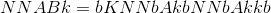

# k-Nearest Neighbors关联

> 译者：[flink.sojb.cn](https://flink.sojb.cn/)


## 描述

实现精确的k近邻连接算法。给出训练集  和测试集 ，算法返回



蛮力方法是计算每个训练点和测试点之间的距离。为了简化计算每个训练点之间距离的强力计算，使用四叉树。四叉树在训练点的数量上很好地扩展，但在空间维度上很差。该算法将自动选择是否使用四叉树，但用户可以通过设置参数来强制使用或不使用四叉树来覆盖该决策。

## 算子操作

`KNN`是一个`Predictor`。因此，它支持`fit`和`predict` 算子操作。

### 适合

KNN由一组给定的训练`Vector`：

*   `fit[T &lt;: Vector]: DataSet[T] =&gt; Unit`

### 预测

KNN预测FlinkML的所有子类型`Vector`对应的类标签：

*   `predict[T &lt;: Vector]: DataSet[T] =&gt; DataSet[(T, Array[Vector])]`，`(T, Array[Vector])`元组对应的（测试点，K-最近的训练点）

## 参数

KNN实现可以通过以下参数控制：

| 参数 | 描述 |
| --- | --- |
| **ķ** | 定义要搜索的最近邻居数。也就是说，对于每个测试点，算法在训练集中找到K-最近邻居（默认值：**5**） |
| **DistanceMetric** | 设置我们用于计算两点之间距离的距离度量。如果未指定度量标准，则使用[[org.apache.flink.ml.metrics.distances.EuclideanDistanceMetric]]。（默认值：**EuclideanDistanceMetric**） |
| **块** | 设置输入数据将被分割到的块数。此数字应至少设置为并行度。如果未指定任何值，则输入[[DataSet]]的并行性将用作块数。（默认值：**无**） |
| **UseQuadTree** | 一个布尔变量，无论是否使用四叉树来划分训练集，都可能简化KNN搜索。如果未指定任何值，代码将自动决定是否使用四叉树。四叉树的使用与训练和测试点的数量很好地对应，但是尺寸很差。（默认值：**无**） |
| **SizeHint** | 指定训练集或测试集是否很小，以优化KNN搜索所需的跨产品 算子操作。如果训练集很小，则应该是“CrossHint.FIRST_IS_SMALL”并且如果测试集很小则设置为“CrossHint.SECOND_IS_SMALL”。（默认值：**无**） |

## 例子


```
import org.apache.flink.api.common.operators.base.CrossOperatorBase.CrossHint
import org.apache.flink.api.scala._
import org.apache.flink.ml.nn.KNN
import org.apache.flink.ml.math.Vector
import org.apache.flink.ml.metrics.distances.SquaredEuclideanDistanceMetric

val env = ExecutionEnvironment.getExecutionEnvironment

// prepare data val trainingSet: DataSet[Vector] = ...
val testingSet: DataSet[Vector] = ...

val knn = KNN()
  .setK(3)
  .setBlocks(10)
  .setDistanceMetric(SquaredEuclideanDistanceMetric())
  .setUseQuadTree(false)
  .setSizeHint(CrossHint.SECOND_IS_SMALL)

// run knn join knn.fit(trainingSet)
val result = knn.predict(testingSet).collect()
```


有关使用和不使用和四叉树计算KNN的更多详细信息，请参阅以下内容：[http](http://danielblazevski.github.io/)：[//danielblazevski.github.io/](http://danielblazevski.github.io/)

